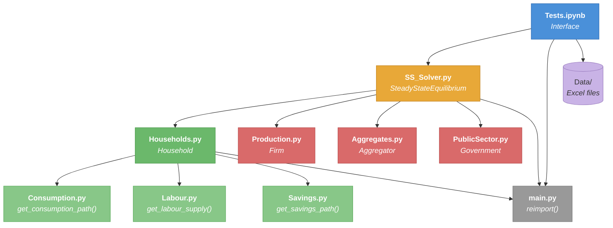
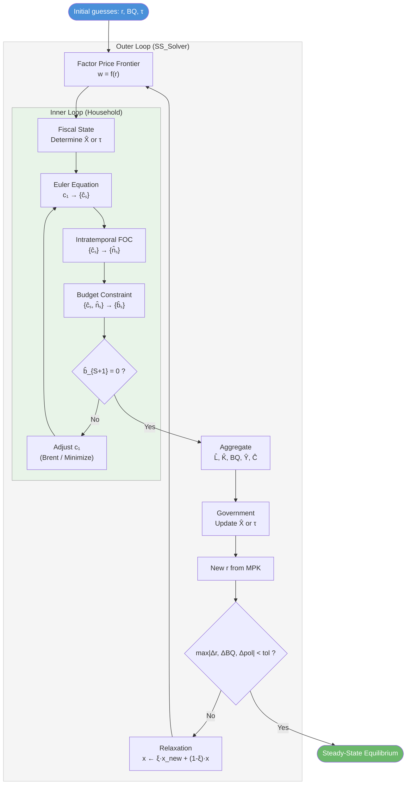

# Cost of Ageing — OLG General Equilibrium Model

A numerical Overlapping Generations (OLG) model for quantifying the macroeconomic cost of population ageing. The model solves for a steady-state general equilibrium where heterogeneous-age households optimise consumption, labour supply, and savings; a representative firm produces output via Cobb-Douglas technology; and a government runs a pay-as-you-go pension system funded by taxation.

Calibrated to Russian demographic projections (population, mortality, and migration by single year of age, 2024–2100).

---

## Repository Structure

```
Cost_of_ageing/
├── main.py                              # Hot-reload utility for notebook development
├── Individual_level/
│   ├── Consumption.py                   # Lifecycle consumption path (Euler equation)
│   ├── Labour.py                        # Labour supply (intratemporal FOC, elliptic disutility)
│   ├── Savings.py                       # Savings path (budget constraint)
│   └── Households.py                    # Household coordinator + shooting method solver
├── State_level/
│   ├── Production.py                    # Firm: Cobb-Douglas output, factor prices
│   ├── Aggregates.py                    # Aggregator: L̂, K̂, Ĉ, BQ from individual paths
│   └── PublicSector.py                  # Government: pensions, tax revenue, required tax rates
├── Steady_state_equilibrium/
│   └── SS_Solver.py                     # Outer-loop steady-state solver (coordinates all agents)
├── Interface (via Notebooks)/
│   └── Tests.ipynb                      # Data loading, calibration, and model runs
└── Data/                                # Demographic input data (Excel, not tracked in git)
    ├── total_pop.xlsx
    ├── death_probability.xlsx
    └── age specific migration.xlsx
```

### Module Dependency Graph



### Solution Algorithm Flow



---

## Model Overview

### Agents

| Agent | Module | Role |
|-------|--------|------|
| **Household** | `Individual_level/` | Lives from age $E{+}1$ to $S$. Chooses consumption $\hat{c}_s$, labour $\hat{n}_s$, and savings $\hat{b}_s$ to maximise lifetime utility. |
| **Firm** | `State_level/Production.py` | Operates Cobb-Douglas technology $\hat{Y} = A\hat{K}^\alpha\hat{L}^{1-\alpha}$. Pays factors their marginal products. |
| **Government** | `State_level/PublicSector.py` | Collects labour, capital, and corporate taxes. Distributes flat pension $\hat{X}$ to retirees $s > R$. |

### Key Equations

**Stationary Euler Equation (consumption):**

$$\hat{c}_{s+1} = \hat{c}_s \left[\beta(1-\rho_s)(1+r^{net})\right]^{1/\sigma} e^{-g_y}$$

**Labour Supply (elliptic disutility):**

$$\hat{n}_s = \tilde{l}\left[1 + \left(\frac{b \cdot \hat{c}_s^\sigma}{\tilde{l} \cdot w(1-\tau^l)}\right)^{\upsilon/(\upsilon-1)}\right]^{-1/\upsilon}$$

**Budget Constraint (savings):**

$$\hat{b}_{s+1} = e^{-g_y}\left[(1-\tau^l)w\hat{n}_s + (1+r^{net})\hat{b}_s + \hat{X}_s + \widehat{BQ} - \hat{c}_s\right]$$

**Cobb-Douglas Production:**

$$\hat{Y} = A\hat{K}^\alpha\hat{L}^{1-\alpha}$$

All variables with hats ($\hat{\cdot}$) are growth-adjusted (stationarised by labour-augmenting technical progress $g_y$ and population growth $g_n$).

### Calibration Parameters

| Symbol | Parameter | Default |
|--------|-----------|---------|
| $A$ | Total factor productivity | 1.4 |
| $\alpha$ | Capital share | 0.39 |
| $\delta$ | Depreciation rate | 0.05 |
| $\beta$ | Subjective discount factor | 0.905 |
| $\sigma$ | Relative risk aversion | 1.97 |
| $g_y$ | Labour-augmenting tech growth | 0.054 |
| $\tilde{l}$ | Time endowment | 1.0 |
| $b$ | Elliptic disutility parameter | 0.4309 |
| $\upsilon$ | Elliptic curvature | 1.7648 |
| $E$ | Entry age | 20 |
| $R$ | Retirement age | 65 |
| $S$ | Maximum age | 100 |
| $\tau^l$ | Labour income tax | 0.30 |
| $\tau^k$ | Capital income tax | 0.00 |
| $\tau^c$ | Corporate profit tax | 0.00 |

### Demographic Inputs (Data/)

| File | Content |
|------|---------|
| `total_pop.xlsx` | Population by single year of age (0–100), projected 2024–2100 |
| `death_probability.xlsx` | Age-specific mortality rates $\rho_s$, projected 2024–2100 |
| `age specific migration.xlsx` | Net migration totals by year + age-specific migration rate distribution |

---

## Policy Modes

The solver supports two fiscal experiments via the `policy_mode` parameter:

| Mode | `policy_mode` | What it solves for | What is fixed |
|------|---------------|--------------------|---------------|
| **Fix tax** | `'fix_tax'` | Pension benefit $\hat{X}$ | Tax rate of chosen type |
| **Fix pension** | `'fix_pension'` | Required tax rate | Pension level $\hat{X} = \text{replacement\_rate} \times w$ |

In `fix_pension` mode, the `tax_type` argument selects which tax instrument adjusts (`'tau_l'`, `'tau_k'`, or `'tau_c'`). This enables counterfactual analysis: "If the pension replacement rate is held constant as the population ages, how much must tax rates rise?"

---

## Usage

### Prerequisites

- Python 3.10+
- NumPy, SciPy, Pandas, Matplotlib

### Running the Model

The primary interface is the Jupyter notebook `Interface (via Notebooks)/Tests.ipynb`. It:

1. Loads demographic data from `Data/`
2. Normalises population distributions
3. Calibrates model parameters
4. Solves the steady-state equilibrium
5. Produces diagnostic plots (consumption, labour, savings lifecycle profiles)

```python
from Steady_state_equilibrium.SS_Solver import SteadyStateEquilibrium

ss = SteadyStateEquilibrium(params, vectors)
results = ss.solve(
    r_guess=0.1,
    BQ_guess=0.2,
    tax_guess=0.1,
    policy_mode='fix_pension',
    tax_type='tau_l',
    xi=0.2,
    tol=1e-5,
    max_iter=300,
    debug=True
)
```

The `results` dictionary contains all equilibrium quantities: `r`, `w`, `BQ`, `Y`, `K`, `L`, `C`, lifecycle vectors `c_vec`, `n_vec`, `b_vec`, tax rates, and pension levels.

### Hot Reloading

During iterative development in notebooks, call `reimport()` from `main.py` to reload all project modules without restarting the kernel:

```python
from main import reimport
reimport()
```

---

## Convergence

The outer loop uses relaxation (dampening factor $\xi \in (0,1]$) to update guesses:

$$x^{(k+1)} = \xi \cdot x^{new} + (1-\xi) \cdot x^{(k)}$$

Convergence is declared when $\max(|\Delta r|, |\Delta BQ|, |\Delta \text{policy}|) < \text{tol}$.

The inner loop (household problem) uses Brent's root-finding method on the terminal savings condition $\hat{b}_{S+1} = 0$, with a squared-error minimisation fallback and a borrowing penalty to guide the solver toward economically feasible paths.

---

## Validation

The solver includes built-in diagnostic checks:

- **Goods market clearing:** Verifies $\hat{Y} = \hat{C} + \hat{I} - \text{migration term}$
- **Euler equation errors:** Checks intertemporal optimality across the lifecycle
- **Lifecycle plots:** Visual inspection of $\hat{c}_s$, $\hat{n}_s$, $\hat{b}_s$ profiles
